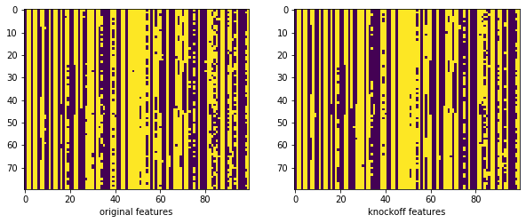

```python
import numpy as np
import pandas as pd
from pylab import *
from Ising_Knockoffs import Ising_Knockoffs
```

Load Ising data and the respective coupling matrix


```python
Z = np.array(pd.read_csv("data\\Z.csv"))
Theta = np.array(pd.read_csv("data\\Theta.csv"))
```

Create Instance of sampler


```python
sampler = Ising_Knockoffs(Z, Theta)
```

Sample knockoffs


```python
Z_tilde = sampler.sample_knockoffs()
```

Visualize results


```python
fig, ax = subplots(1, 2, figsize=(10, 20))
ax[0].imshow(Z)
ax[0].set_xlabel("original features")
ax[1].set_xlabel("knockoff features")
ax[1].imshow(Z_tilde)
show()
```




